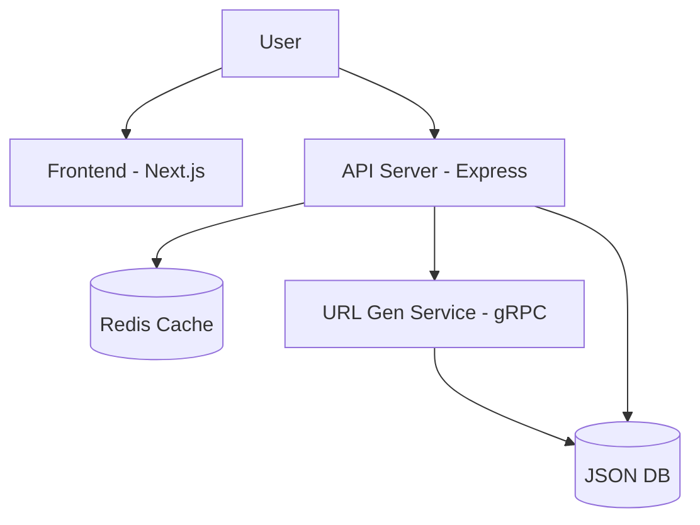

# TinyURL Service 🚀

A high-performance, enterprise-grade URL shortener application built with a modern microservices architecture. It leverages gRPC for internal communication, Redis for high-speed caching, and Bun/Node.js for backend execution.


## 🌟 Key Features

-   **Microservices Architecture**: Separate services for API handling and URL generation.
-   **Zero-Latency Allocation**: Pre-generated pool of short codes via gRPC service.
-   **High-Performance Caching**: Redis-backed cache with **LFU (Least Frequently Used)** eviction policy.
-   **Modern Frontend**: Built with Next.js 14, standard Tailwind CSS, and glassmorphism design.
-   **Robust Persistence**: JSON-based file storage (easily swappable for SQL/NoSQL).
-   **Containerized**: Fully Dockerized for zero-config deployment.

### 📐 Architecture Diagram



## 🏗️ Architecture Overview

The system comprises three primary containers orchestration via Docker Compose:

| Service | Technology | Description | Port |
| :--- | :--- | :--- | :--- |
| **Frontend** | Next.js 14, Tailwind | User interface for shortening and managing links. | `3000` |
| **API Server** | Express, Bun, ioredis | Handles HTTP requests, caching logic, and DB I/O. | `3001` |
| **URL Gen Service** | gRPC, ProtoBuf | Generates unique IDs ensuring no collision at runtime. | `50051` |

## 🛠️ Installation & Setup

### Option A: Docker (Recommended)

Run the entire stack with a single command.

1.  **Clone the repository**:
    ```bash
    git clone https://github.com/lwshakib/tinyurl-link-shortener.git
    cd tinyurl-link-shortener
    ```

2.  **Start Services**:
    ```bash
    docker-compose up -d --build
    ```

3.  **Access the App**:
    -   Frontend: [http://localhost:3000](http://localhost:3000)
    -   Backend Health: [http://localhost:3001/health](http://localhost:3001/health)

### Option B: Local Development

For developing individual services:

**1. Database Setup**
Ensure the root `db.json` exists or let the server create it.
```bash
touch server/db.json
```

**2. Start Redis**
```bash
docker run -p 6379:6379 -d redis:alpine
```

**3. Start URL Generation Service**
This service must be running for the main server to fetch codes.
```bash
cd url-generation-service
bun install
bun run src/index.ts
```

**4. Start API Server**
 in a new terminal:
```bash
cd server
bun install
bun dev
```

**5. Start Frontend**
In a new terminal:
```bash
cd web
npm install
npm run dev
```

## 🧩 Project Structure

```
tinyurl-link-shortener/
├── docker-compose.yml       # Orchestration
├── proto/
│   └── shortcode.proto      # gRPC Definitions
├── server/                  # Express API Server
│   ├── src/
│   │   ├── db.ts            # Database Helpers
│   │   ├── index.ts         # Main Entry point
│   │   └── services/        # Internal Services
│   └── db.json              # Data Store
├── url-generation-service/  # gRPC Microservice
│   └── src/index.ts         # Generator Logic
└── web/                     # Next.js Frontend
    ├── app/                 # App Router
    └── public/              # Static Assets
```

## 🤝 Contributing

We welcome contributions! Please check our [CONTRIBUTING.md](CONTRIBUTING.md) for detailed guidelines on how to clone, branch, and push changes.

## 📄 License

This project is open-source and available under the [MIT License](LICENSE).