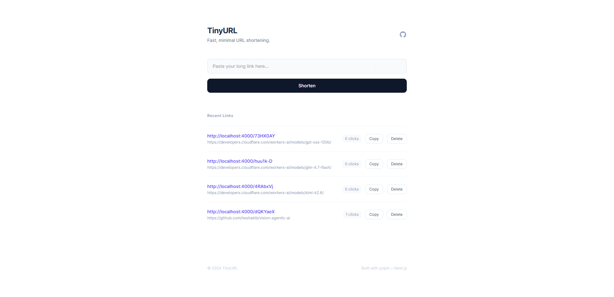
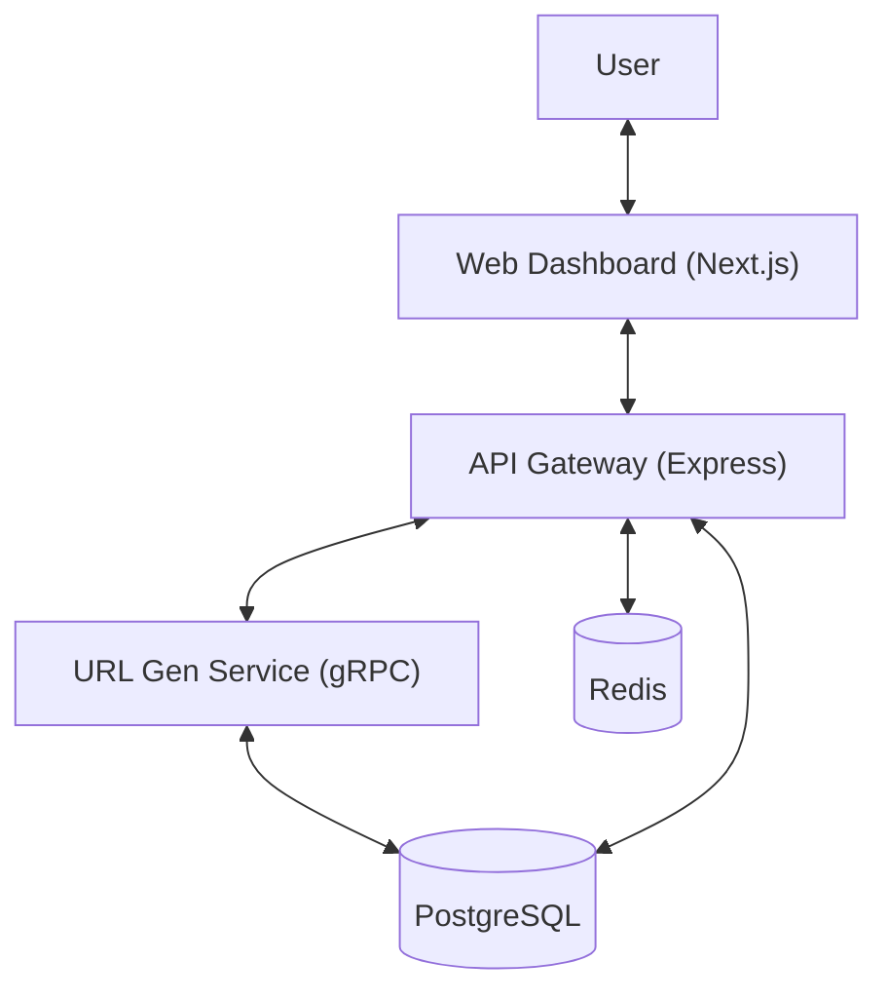

# TinyURL Link Shortener

A premium, high-performance URL shortening service built with Next.js, Express, gRPC, and PostgreSQL.



## 🏗️ Architecture


```mermaid
graph TD
    User["User"]
    Web["Web Dashboard (Next.js)"]
    Server["API Gateway (Express)"]
    UrlGen["URL Gen Service (gRPC)"]
    DB[("PostgreSQL")]
    Cache[("Redis")]

    User <--> Web
    Web <--> Server
    Server <--> UrlGen
    UrlGen <--> DB
    Server <--> DB
    Server <--> Cache
```

## 🚀 Features

- **Microservices Architecture**: Decoupled services communicating via high-performance gRPC.
- **Turbocharged Redirects**: Redis-backed caching for instant URL resolution.
- **Premium Analytics**: Real-time click tracking and link management.
- **Type-Safe Development**: Full-stack TypeScript with shared workspace configurations.
- **Container First**: Optimized Docker setup for seamless development and production.

## 🛠️ Technology Stack

- **Frontend**: Next.js 16, Tailwind CSS v4, Iconify
- **Backend**: Node.js 20, Express, gRPC
- **Persistence**: PostgreSQL 17, Redis 7
- **Infrastructure**: pnpm Workspaces, Turborepo, Docker Compose

## 🏁 Getting Started

### Prerequisites

- Node.js (>= 20)
- pnpm (>= 9)
- Docker Desktop

### Installation

1. **Clone the repository**:
   ```bash
   git clone https://github.com/lwshakib/tinyurl-link-shortener.git
   cd tinyurl-link-shortener
   ```

2. **Start Infrastructure**:
   ```bash
   docker-compose up -d
   ```

3. **Install Dependencies**:
   ```bash
   pnpm install
   ```

4. **Initialize Environment**:
   ```bash
   cp apps/server/.env.example apps/server/.env
   cp apps/web/.env.example apps/web/.env
   ```

### Running Locally

```bash
# Start all services in development mode
pnpm dev

# Build all packages and apps
pnpm build
```

## 📈 Service Ports

- **Frontend**: [http://localhost:3000](http://localhost:3000)
- **API Server**: [http://localhost:4000](http://localhost:4000)
- **PostgreSQL**: `localhost:5432`
- **Redis**: `localhost:6379`

## 🤝 Contributing

Contributions make the open-source community an amazing place to learn, inspire, and create. Any contributions you make are **greatly appreciated**. Please see [CONTRIBUTING.md](CONTRIBUTING.md) for details.

## 📜 License

Distributed under the MIT License. See `LICENSE` for more information.

## ✉️ Contact

**Shakib Khan** - [@lwshakib](https://github.com/lwshakib)
